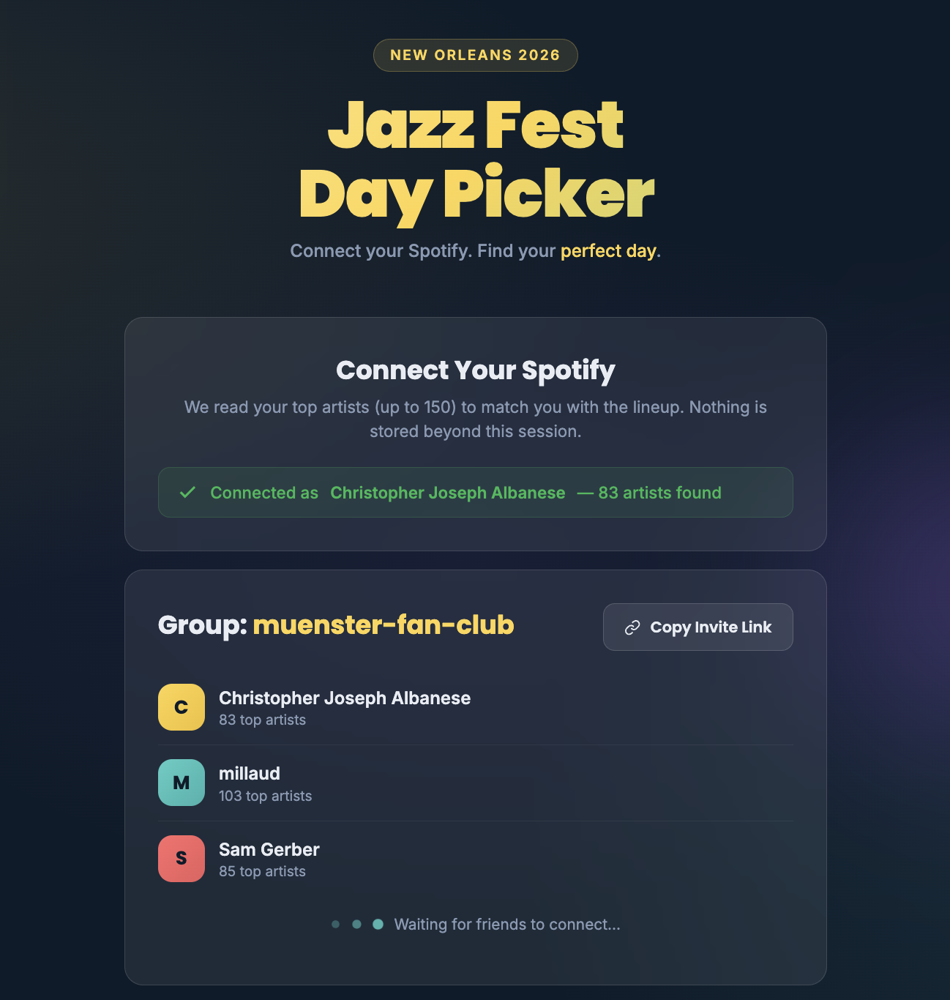
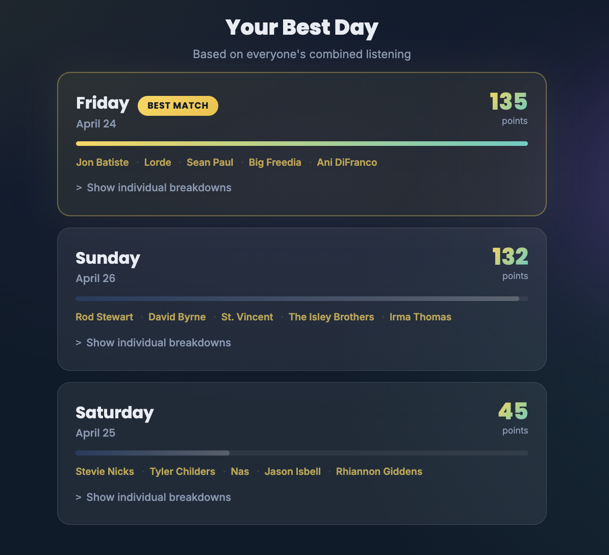
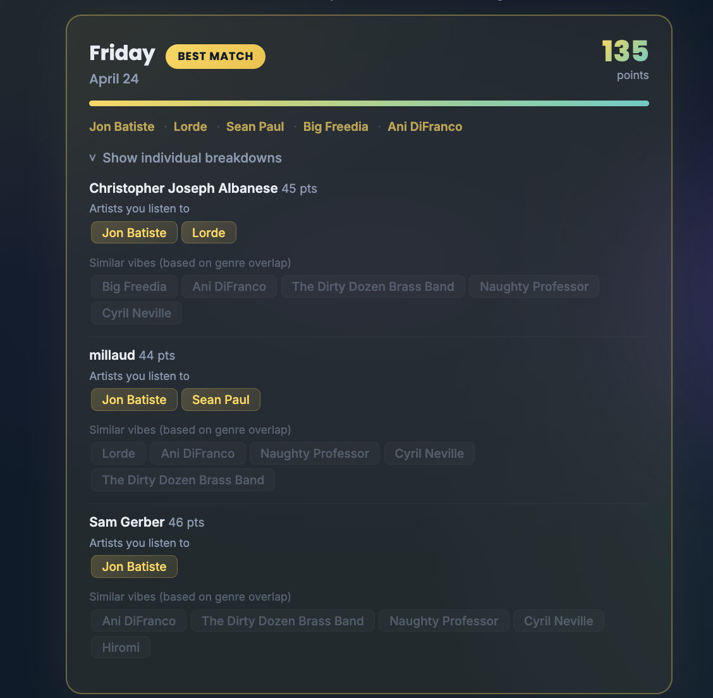

# Jazz Fest Day Picker

A web app that helps friend groups pick the best day to attend New Orleans Jazz Fest by cross-referencing everyone's Spotify listening history with the festival lineup.

## How it works

1. Create a group and share the link with friends
2. Everyone connects their Spotify account
3. The app pulls each person's top artists (with listening-intensity weighting) and scans liked songs for lineup matches
4. Scores each festival day based on the group's combined music taste
5. Results update live as friends connect

## Scoring

- **Direct artist matches** are weighted by how much you listen to them (recent + frequent = higher weight)
- **Liked songs** are scanned for lineup artists that aren't in your top 50
- **Genre matches** contribute a smaller amount based on overlap between your artists' genres and lineup artists' genres
- Headliners are weighted more heavily than undercard acts

## Tech

- Single-page static HTML/CSS/JS — no build step, no framework
- Spotify Authorization Code + PKCE flow (no server needed)
- Supabase for real-time group data storage
- Deployed on GitHub Pages

## Live

**https://cjalbanese.github.io/jazzfest-matcher/**
